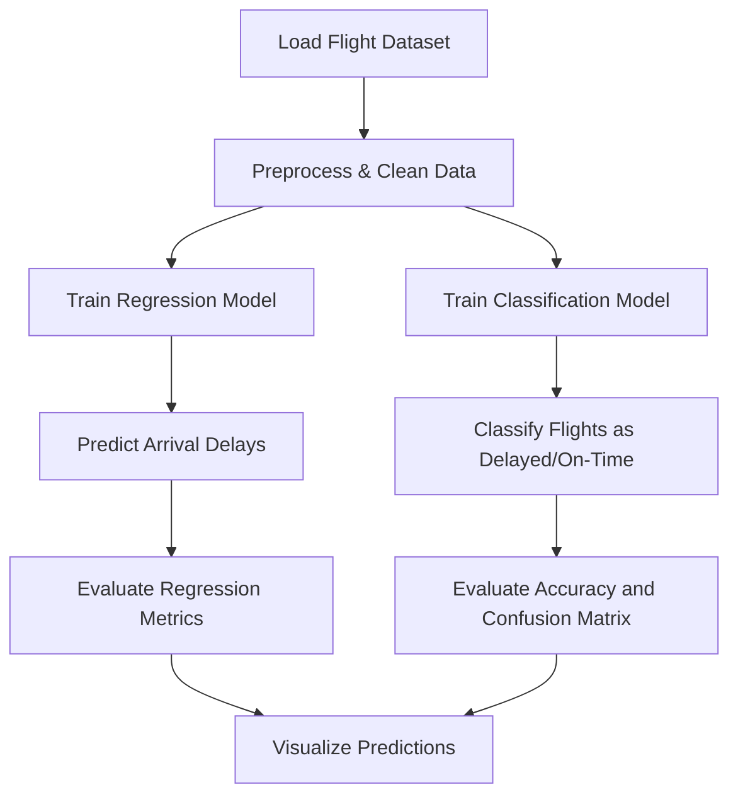

# 🛫 FlightDelayML – Flight Delay Detection using Machine Learning

  
  
  


> ⏱️ A machine learning project that predicts flight arrival delays and classifies flights as delayed or on-time based on various delay factors.

---

## 🚀 Features

- 📉 **Regression Modeling** using Linear Regression to predict numeric arrival delay
- ✅ **Classification Modeling** with Decision Tree to detect delayed flights (accuracy: 98%)
- 📊 **Visualization Dashboard** with scatter plots, feature importance, and confusion matrix
- 🧼 Data cleaning, encoding, and feature engineering for improved model performance
- 🧪 Evaluated using R², MAE, MSE for regression and accuracy/F1-score for classification

---

## 📌 Technologies Used

| Component            | Tool/Library            |
|----------------------|-------------------------|
| Language             | Python 3.10             |
| ML Models            | LinearRegression, DecisionTreeClassifier |
| Data Handling        | pandas, NumPy           |
| Visualization        | Matplotlib, Seaborn     |
| Evaluation Metrics   | scikit-learn (MAE, R², accuracy, F1-score) |

---

## ⚙️ Installation

```bash
git clone https://github.com/akasha456/Flight-Delay-Detection
cd Flight-Delay-Detection
pip install -r requirements.txt
```

---

## 🧠 How It Works



---

## 📊 Model Evaluation Snapshot

### 🔷 Regression (Arrival Delay Prediction)
| Metric | Score |
|--------|-------|
| R² Score | 0.972 |
| MAE | 6.97 |
| MSE | 90.12 |
| Explained Variance | 0.972 |

### 🔶 Classification (Delayed or Not)
| Metric | Score |
|--------|-------|
| Accuracy | 98% |
| Precision | 1.00 (Not Delayed), 0.95 (Delayed) |
| Recall | 0.97 (Not Delayed), 1.00 (Delayed) |
| F1-Score | 0.98 |

---

## 📈 Feature Importance (Decision Tree Classifier)

| Feature           | Importance |
|-------------------|------------|
| NAS_Delay         | 0.5882     |
| Dep_Delay         | 0.4118     |
| Others            | 0.0000     |

---

## 🌐 Future Enhancements

- ✈️ Integrate live flight data via airline APIs
- 📍 Add geographical visualization of delays by airport
- 🧠 Explore ensemble models (Random Forest, XGBoost)
- 🗂️ Summarize delays by day, airline, or region
- 📱 Build a simple UI for user input and results visualization

---

## 📜 License

This project is licensed under the MIT License.

---

## 💬 Acknowledgements

- [Scikit-learn](https://scikit-learn.org) for ML algorithms  
- [Matplotlib](https://matplotlib.org) and [Seaborn](https://seaborn.pydata.org) for visualizations  
- [Kaggle](https://www.kaggle.com) for access to flight datasets  

---

